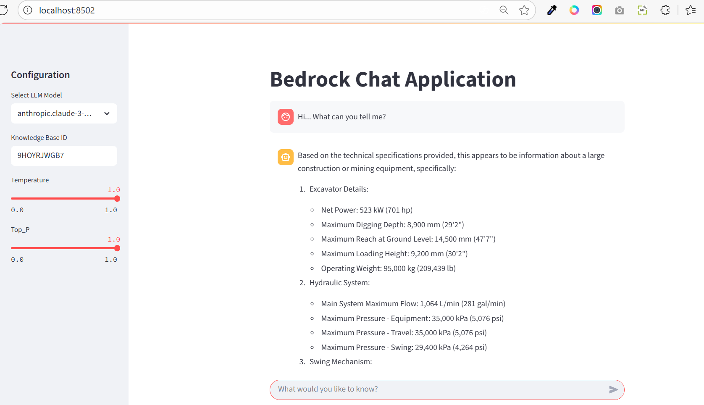

## ⭐ AWS Bedrock Knowledge Base + Aurora Serverless



Welcome — this repository demonstrates an end-to-end Retrieval-Augmented Generation (RAG) demo built on AWS using Amazon Bedrock (for both the Knowledge Base/Agent and model runtime) and Aurora Serverless (PostgreSQL) for vector storage.

This project ingests PDF documentation into S3, indexes passages into Aurora with `pgvector`/HNSW, exposes those passages through a Bedrock Agent Knowledge Base, and runs retrieval + generation using an Anthropic Claude foundation model hosted via Amazon Bedrock.

---

  
  

**Quick summary**

- Infrastructure: Terraform stacks to provision VPC, Aurora Serverless (Postgres), S3, Secrets Manager, and Bedrock KB resources
- DB: PostgreSQL with `pgvector` extension and HNSW index for fast vector retrieval
- Storage: S3 used to host PDFs and other source files
- Application: Python helpers (`bedrock_utils.py`) and Streamlit demo (`app.py`, `streamlit_app.py`)
- Foundation model: Anthropic Claude (invoked via Amazon Bedrock)

**Example KB ID used in the demo:** `9HOYRJWGB7`

---

## Stack

This project uses the following stacks and services (stack = logical grouping of infra/config):

- **Stack 1 — Infrastructure (Terraform)**: VPC, subnets, security groups, Aurora Serverless (Postgres), Secrets Manager secret, S3 bucket used to host source documents.
- **Stack 2 — Bedrock KB & IAM (Terraform)**: Bedrock Agent Knowledge Base resources, IAM roles and policies needed for Bedrock Agent to access S3 and RDS, and Bedrock KB configuration.
- **Application stack**: Python application and Streamlit UI that use the Bedrock Agent runtime and Bedrock model runtime to do retrieval and generation.

Key services:

- AWS (cloud provider)
- Amazon Bedrock (Knowledge Base / Agent and foundation model runtime — Anthropic Claude)
- Amazon Aurora Serverless (Postgres with `pgvector` extension)
- Amazon S3 (document storage)
- AWS Secrets Manager (DB credentials)
- Terraform (IaC)
- Streamlit (interactive demo UI)

> Note: yes — it's common and appropriate to list the cloud and managed services (AWS, Amazon Bedrock, Aurora, S3, etc.) as part of the "stack" for the project. This helps readers understand platform dependencies and any potential costs/permissions required.

## Certification

This project was built as part of a certification exercise — see the badge below:


**Table of contents**

1. Features
2. Requirements
3. Repo layout
4. Quick start (deploy & run)
5. Streamlit demo usage
6. Diagnostics & troubleshooting
7. Contributing
8. License & credits

**1) Features**

- End-to-end Terraform + Python demo wiring S3 → Bedrock KB → Aurora → Bedrock model
- Example SQL to initialize vector storage and build indexes
- Python scripts for upload, DB init, model listing, diagnostics and tests
- Normalized retrieval handling and provider-aware model payloads
- Two Streamlit frontends: a compact `app.py` and a more feature-rich `streamlit_app.py`

**2) Requirements**

- AWS account with Bedrock and Bedrock Agent features enabled in `us-west-2` (or adjust region in code)
- Terraform (recommended v1.x)
- Python 3.9+ (upgrade to 3.10+ recommended due to upcoming boto3 deprecation)
- `pip` to install dependencies
- AWS CLI configured with credentials that have the necessary IAM permissions

**3) Repo layout**

`/` project root

- `stack1/` — Terraform: VPC, Aurora Serverless, S3, Secrets Manager
- `stack2/` — Terraform: Bedrock Knowledge Base + IAM
- `modules/` — reusable TF modules
- `scripts/` — Python scripts (upload, DB init, diagnostics)
- `cd13926-...-project-solution/` — Python app code (`bedrock_utils.py`, `app.py`, `streamlit_app.py`)

**4) Quick start (deploy & run)**

1) Initialize and apply Stack 1:

```powershell
cd stack1
terraform init
terraform apply -auto-approve
# Capture outputs: aurora cluster ARN, secret ARN, s3 bucket
```

2) Initialize database (use `scripts/run_sql_rdsdata.py`):

```powershell
# ensure run_sql_rdsdata.py has the correct ARNs or pass via environment
python ..\scripts\run_sql_rdsdata.py
```

3) Apply Stack 2 (Bedrock KB):

```powershell
cd ../stack2
terraform init
terraform apply -auto-approve
```

4) Upload PDF files to S3 and sync KB:

```powershell
cd ..
python scripts/upload_s3.py
# Then sync the Bedrock KB datasource in the Bedrock Console (or use the agent API)
```

**5) Streamlit demo**

Install dependencies and run:

```powershell
python -m venv venv
& venv\Scripts\Activate.ps1
pip install -r requirements.txt
streamlit run streamlit_app.py
```

The KB id `9HOYRJWGB7` is prefilled in the UI for convenience; you can replace it in the sidebar.

**6) Diagnostics & troubleshooting**

- AccessDenied for `bedrock:InvokeModel` / `bedrock:Retrieve`:
  - Check `aws sts get-caller-identity` to see which role/credentials are active
  - Inspect inline/managed policies and remove explicit `Deny` or add explicit `Allow` for the Bedrock actions
  - Organization SCPs and permission boundaries may also block these actions

- No retrievals or missing text: use `scripts/diagnose_kb.py` to dump the raw retrieve response, S3 objects list, and sample Aurora `chunks` rows

- Terraform Aurora engine errors: ensure engine version is supported (e.g., use 15.8 if 15.4 is unsupported)

**7) Contributing**

- Feel free to file issues or PRs. Suggested tasks:
  - Add unit tests for `bedrock_utils.py` normalization
  - Harden the Streamlit UI to avoid startup API calls and show friendly permission errors

**8) License & credits**

This repository is a learning/demo project. Add a license file if you plan to publish.